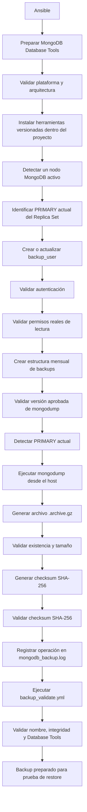

# Guía de Backups y Restauración en MongoDB Swarm

Este documento describe la automatización de respaldos para un clúster **MongoDB Replica Set** desplegado sobre **Docker Swarm**.

La solución utiliza **Ansible** para preparar las herramientas oficiales de MongoDB, gestionar el usuario de respaldo, generar backups comprimidos, calcular su integridad mediante SHA-256 y validar los archivos generados.

La implementación está parametrizada para facilitar su utilización en los ambientes:

- LOCAL
- DESARROLLO
- PRODUCCIÓN

sin modificar la lógica principal de los playbooks.

---

## 🔄 Flujo automatizado del backup



---

## 🗂️ Playbooks de Backup

La automatización de respaldo se divide en cuatro playbooks especializados:

### 1. 🛠️ Preparación de MongoDB Database Tools

- **Archivo:** `playbooks/backup/backup_tools_setup.yml`

**Función:**
- Detecta el sistema operativo y arquitectura.
- Comprueba que correspondan con la plataforma configurada.
- Construye dinámicamente el nombre del paquete oficial de MongoDB Database Tools.
- Descarga las herramientas mediante HTTPS.
- Extrae los binarios dentro del proyecto.
- No requiere instalación global mediante `apt`.
- No modifica `/usr/bin`.
- Valida las versiones de `mongodump` y `mongorestore`.
- Elimina los archivos temporales utilizados durante la preparación.

Las herramientas quedan versionadas en:
```text
tools/mongodb-database-tools/<version>/bin/
```

Por ejemplo:
```text
tools/mongodb-database-tools/100.18.0/bin/mongodump
tools/mongodb-database-tools/100.18.0/bin/mongorestore
```

La plataforma se configura mediante variables como:
```yaml
mongodb_tools_platform: "ubuntu2604"
mongodb_tools_arch: "x86_64"
mongodb_tools_version: "100.18.0"
```

Esto permite utilizar el mismo playbook en LOCAL, DESARROLLO y PRODUCCIÓN, cambiando únicamente las variables correspondientes al ambiente.

---

### 2. 🔑 Creación del usuario de respaldo

- **Archivo:** `playbooks/backup/backup_create_users.yml`

**Función:**
- Busca dinámicamente un nodo MongoDB activo.
- Consulta cuál es el PRIMARY actual del Replica Set.
- Localiza el contenedor correspondiente al PRIMARY.
- Crea o actualiza el usuario: `backup_user`.
- Las credenciales se obtienen desde `vars/vault_mongodb.yml` protegido mediante Ansible Vault.

El usuario utiliza el principio de mínimo privilegio:
```json
{
    "role": "read",
    "db": "<mongo_database>"
}
```

Después de crear o actualizar el usuario, Ansible valida:
- Autenticación correcta.
- Acceso a la base configurada.
- Capacidad real de lectura.
- Capacidad de listar las colecciones existentes.

La validación no escribe, modifica ni elimina información de la base de datos.

---

### 3. 💾 Ejecución del respaldo

- **Archivo:** `playbooks/backup/backup_run.yml`

**Función:**
- Genera fecha y hora del respaldo.
- Crea automáticamente la estructura mensual: `backups/mongodb/<database>/YYYY-MM/`.
- Crea el directorio de bitácoras.
- Valida la versión aprobada de `mongodump`.
- Detecta un nodo MongoDB disponible.
- Identifica el PRIMARY actual del Replica Set.
- Registra el PRIMARY encontrado.
- Utiliza el endpoint configurado mediante `mongo_backup_host` y `mongo_backup_port`.
- Ejecuta `mongodump` desde el host utilizando las Database Tools versionadas:
  `tools/mongodb-database-tools/<version>/bin/mongodump`.
- Genera el respaldo directamente en el repositorio de backups.
- Utiliza formato archive y compresión gzip.
- Valida que el archivo exista y que su tamaño sea mayor a cero.
- Genera y comprueba inmediatamente el checksum SHA-256.
- Registra la operación en la bitácora.

El respaldo utiliza el formato:
```text
<database>_YYYYMMDD_HHMMSS.archive.gz
```

Por ejemplo:
```text
prueba_ha_20260821_142801.archive.gz
prueba_ha_20260821_142801.archive.gz.sha256
```

> ⚠️ **Importante:** `mongodump` ya no se ejecuta dentro del contenedor MongoDB. El backup se genera directamente desde las Database Tools controladas por el proyecto.

---

### 4. ✅ Validación del respaldo

- **Archivo:** `playbooks/backup/backup_validate.yml`

**Función:**
- Localiza automáticamente el respaldo más reciente.
- Comprueba que el archivo exista y no esté vacío.
- Localiza su archivo `.sha256`.
- Valida la integridad SHA-256.
- Comprueba la convención institucional del nombre.
- Comprueba la versión aprobada de `mongodump` y `mongorestore`.

El resultado esperado es:
```text
BACKUP INTEGRO Y PREPARADO PARA PRUEBA DE RESTORE
```

Esta validación confirma la integridad del backup. La capacidad real de restauración será comprobada posteriormente mediante una prueba controlada con `mongorestore`.

---

## ⚙️ Configuración y credenciales

### Variables comunes

Las configuraciones generales se encuentran en `vars/common.yml`:

```yaml
mongodb_tools_version: "100.18.0"
mongodb_tools_version_policy: "supported_for_platform"

backup_checksum_algorithm: "sha256"
backup_extension: ".archive.gz"

backup_retention_days: 30
backup_monthly_retention_months: 12

backup_schedule_hour: "02"
backup_schedule_minute: "00"
```

### Variables por ambiente

- **LOCAL:** `vars/local.yml`
- **DESARROLLO:** `vars/development.yml`
- **PRODUCCIÓN:** `vars/production.yml`

Ejemplo de variables de conexión (`vars/local.yml`):

```yaml
environment_name: "local"

mongo_database: "prueba_ha"

mongo_backup_host: "127.0.0.1"
mongo_backup_port: 27017

mongodb_tools_platform: "ubuntu2604"
mongodb_tools_arch: "x86_64"
```

Los valores de Desarrollo y Producción deben corresponder a la plataforma, arquitectura y endpoint reales de cada ambiente.

### 🔐 Credenciales protegidas

Las credenciales reales deben estar almacenadas en `vars/vault_mongodb.yml` protegido mediante Ansible Vault.

Plantilla de referencia (`vars/vault_mongodb.example.yml`):

```yaml
---
mongo_admin_user: "admin"
mongo_admin_password: "[PASSWORD]"

mongo_backup_user: "backup_user"
mongo_backup_password: "[PASSWORD]"

mongo_restore_user: "restore_user"
mongo_restore_password: "[PASSWORD]"
```


---

## 🚀 Guía de ejecución

Todos los comandos deben ejecutarse desde la raíz del proyecto (`mongo-ansible-v2/`):

### Paso 1. Preparar MongoDB Database Tools
```bash
ansible-playbook playbooks/backup/backup_tools_setup.yml
```

### Paso 2. Crear o actualizar usuario de respaldo
```bash
ansible-playbook playbooks/backup/backup_create_users.yml --ask-vault-pass
```

### Paso 3. Ejecutar el backup
```bash
ansible-playbook playbooks/backup/backup_run.yml --ask-vault-pass
```

### Paso 4. Validar el backup
```bash
ansible-playbook playbooks/backup/backup_validate.yml
```

---

## 📊 Resultado esperado

La estructura resultante será similar a:

```text
backups/
└── mongodb/
    └── prueba_ha/
        └── 2026-08/
            ├── prueba_ha_20260821_142801.archive.gz
            └── prueba_ha_20260821_142801.archive.gz.sha256
```

- El archivo `.archive.gz` corresponde al respaldo MongoDB comprimido.
- El archivo `.archive.gz.sha256` permite comprobar que el respaldo no ha sido modificado o corrompido.

---

## 📝 Bitácora

Cada respaldo exitoso queda registrado en `logs/mongodb_backup.log`.

**Formato:**
```text
TIMESTAMP | environment=<ambiente> | database=<database> | primary=<primary> | host=<backup_host>:<backup_port> | tools_version=<version> | file=<archivo> | size=<bytes> | checksum=OK | result=SUCCESS
```

**Ejemplo:**
```text
20260821_142801 | environment=local | database=prueba_ha | primary=mongo1:27017 | host=127.0.0.1:27017 | tools_version=100.18.0 | file=prueba_ha_20260821_142801.archive.gz | size=561 | checksum=OK | result=SUCCESS
```