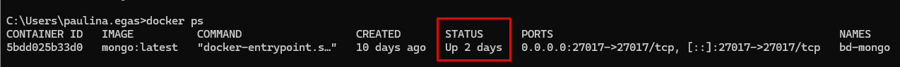
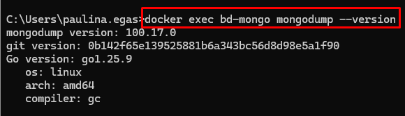
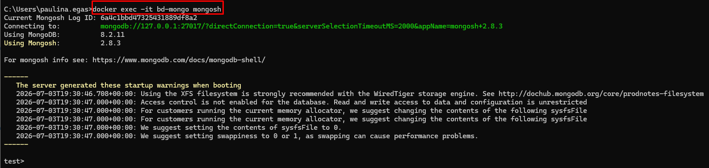
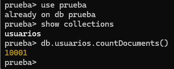

**Implementación de Mecanismos de Respaldo (backup) y Recuperación (restore) de Bases de Datos MongoDB**

**PAS-EST-XXX**

Versión 1.0

© 2026 Dirección Nacional de Tecnologías de la Información

TODOS LOS DERECHOS RESERVADOS

Queda reservado el derecho de propiedad de este documento, con la facultad de disponer de él, publicarlo, traducirlo o autorizar su traducción, así como reproducirlo total o parcialmente, por cualquier sistema o medio.

No se permite la reproducción total o parcial de este documento, ni su incorporación a un sistema informático, ni su locación, ni su transmisión en cualquier forma o por cualquier medio, sea este escrito o electrónico, mecánico, por fotocopia, por grabación u otros métodos, sin el permiso previo y escrito de los titulares de los derechos y del copyright.

FOTOCOPIAR ES DELITO.

Otros nombres de compañías y productos mencionados en este documento pueden ser marcas comerciales o marcas registradas por sus respectivos dueños.

<table><tbody><tr><td colspan="4">
<strong>FIRMAS Y APROBACIONES</strong>
</td></tr><tr><td colspan="4">
<strong>ELABORADO POR:</strong>
</td></tr><tr><td>
<strong>Nombre</strong>
</td><td>
<strong>Cargo - Unidad</strong>
</td><td>
<strong>Fecha</strong>
</td><td>
<strong>Firma</strong>
</td></tr><tr><td>
Paulina de Lourdes Egas Vizcaíno
</td><td>
Analista Informático – Subdirección Nacional de Arquitectura y Soluciones
</td><td></td><td></td></tr><tr><td colspan="4">
<strong>REVISADO POR:</strong>
</td></tr><tr><td>
<strong>Nombre</strong>
</td><td>
<strong>Cargo - Unidad</strong>
</td><td>
<strong>Fecha</strong>
</td><td>
<strong>Firma</strong>
</td></tr><tr><td>
Juan Carlos Estevez Hidalgo
</td><td>
Analista Informático – Subdirección Nacional de Arquitectura y Soluciones
</td><td></td><td></td></tr><tr><td colspan="4">
<strong>APROBADO POR:</strong>
</td></tr><tr><td>
<strong>Nombre</strong>
</td><td>
<strong>Cargo - Unidad</strong>
</td><td>
<strong>Fecha</strong>
</td><td>
<strong>Firma</strong>
</td></tr><tr><td>
Andrés Roberto García Romero
</td><td>
Subdirector – Subdirección Nacional de Arquitectura y Soluciones
</td><td></td><td></td></tr></tbody></table>

| 
**LISTA DE CAMBIOS**

 |
| --- |
| 

**Versión**

 | 

**Fecha**

 | 

**Autor**

 | 

**Descripción**

 |
| 

1.0

 |  | 

Paulina Egas Vizcaíno

 | 

Emisión Inicial.

 |

<table><tbody><tr><td>
<strong>ÍNDICE DE CONTENIDOS</strong>
</td></tr></tbody></table>

[Definiciones, Abreviaturas, Acrónimos 4](#_Toc233206672)

[1\. Antecedentes 5](#_Toc233206673)

[2\. Alcance 5](#_Toc233206674)

[3\. Objetivo 5](#_Toc233206675)

[4\. Ámbito de Aplicación 6](#_Toc233206676)

[5\. Desarrollo 6](#_Toc233206677)

[5.1 Modelo de Integración Entidad/Base de Datos (ORM) 6](#_Toc233206678)

[5.2 Enfoque BDD – Entidad (Database First) 6](#_Toc233206679)

[5.3 Configuración del Dialecto y Compatibilidad con el Motor de Base de Datos 7](#_Toc233206680)

[5.3.1 Configuración Completa para Oracle 7](#_Toc233206681)

[5.3.2 Configuración Completa para PostgreSQL 7](#_Toc233206682)

[5.4 Configuración Obligatoria para Hibernate 8](#_Toc233206683)

[5.5 Generación de Entidades 9](#_Toc233206684)

[5.6 Reglas de Mapeo 11](#_Toc233206685)

[5.6.1 Mapeo de Tablas 12](#_Toc233206686)

[5.6.2 Mapeo de Columnas 13](#_Toc233206687)

[5.6.3 Mapeo de Claves Primarias 14](#_Toc233206688)

[5.6.4 Mapeo de Claves Primarias Compuestas 14](#_Toc233206689)

[5.6.5 Mapeo de Claves Únicas 15](#_Toc233206690)

[5.6.6 Mapeo de Índices Creados en la Base de Datos 16](#_Toc233206691)

[5.6.7 Mapeo de Check Constraints 16](#_Toc233206692)

[5.6.8 Mapeo de Secuencias 17](#_Toc233206693)

[5.6.9 Relaciones entre Entidades 17](#_Toc233206694)

[5.6.10 Campos Calculados 18](#_Toc233206695)

[5.6.11 Restricción NOT NULL 18](#_Toc233206696)

[5.6.12 Correspondencia de Tipos de Dato 18](#_Toc233206697)

[5.6.13 Estándar de Pruebas de Implementación 19](#_Toc233206698)

[6\. Excepciones 19](#_Toc233206699)

[7\. Referencias 19](#_Toc233206700)

**Definiciones, Abreviaturas, Acrónimos**

**DEFINICIONES**

| 
**Definición**

 | 

**Descripción**

 |
| --- | --- |
| 

MongoDB

 | 

Sistema de gestión de bases de datos NoSQL orientado a documentos, que almacena la información en colecciones de documentos BSON y es utilizado como repositorio centralizado de auditoría dentro del stack tecnológico vigente del IESS.

 |
| 

BSON

 | 

BSON (Binary JSON) es una representación binaria de documentos tipo JSON. Creado principalmente para la base de datos **MongoDB**, permite almacenar, procesar y transmitir datos de forma mucho más rápida y eficiente que el formato de texto tradicional.

 |
| 

JSON

 | 

Los documentos tipo **JSON** (JavaScript Object Notation) son archivos de texto ligero y estructurado utilizados principalmente para **almacenar e intercambiar datos** entre diferentes sistemas

 |
| 

Base de Datos Centralizada

 | 

Base de datos MongoDB centralizada destinada al almacenamiento de los eventos generados por las aplicaciones desarrolladas bajo el stack tecnológico vigente del IESS.

 |
| 

Backup (Respaldo)

 | 

Copia de seguridad de la información almacenada en la base de datos MongoDB, generada con el propósito de preservar la información y permitir su recuperación ante fallas, errores operativos o eventos que comprometan su disponibilidad o integridad.

 |
| 

Restore (Restauración)

 | 

Proceso mediante el cual se recupera la información previamente respaldada para restablecer la base de datos a un estado operativo.

 |
| 

mongodump

 | 

Utilidad oficial proporcionada por MongoDB para realizar respaldos lógicos de bases de datos o colecciones, generando archivos en formato BSON y los metadatos asociados.

 |
| 

mongorestore

 | 

Utilidad oficial proporcionada por MongoDB para restaurar la información previamente generada mediante **mongodump**.

 |
| 

Archivo de Respaldo

 | 

Conjunto de archivos generados durante la ejecución del proceso de respaldo, que contienen la información y metadatos necesarios para la restauración de la base de datos.

 |
| 

Política de Retención

 | 

Conjunto de criterios que establece el tiempo durante el cual deberán conservarse los respaldos antes de su eliminación o reemplazo.

 |
| 

Frecuencia de Respaldo

 | 

Periodicidad con la que se ejecuta el proceso de generación de respaldos de la base de datos.

 |
| 

Integridad del Respaldo

 | 

Propiedad que garantiza que la información contenida en un respaldo es completa, consistente y puede ser restaurada sin pérdida o alteración de datos.

 |
| 

Recuperabilidad

 | 

Capacidad de restaurar la base de datos a partir de un respaldo válido, garantizando el restablecimiento de la información y la continuidad del servicio.

 |
| 

Repositorio de Respaldos

 | 

Ubicación física o lógica destinada al almacenamiento seguro de los archivos generados durante el proceso de respaldo, conforme a las políticas institucionales de seguridad de la información.

 |
| 

RPO (Recovery Point Objective)

 | 

Objetivo de Punto de Recuperación. Corresponde a la cantidad máxima de información que la institución está dispuesta a perder como consecuencia de una interrupción del servicio. Determina la frecuencia con la que deberán ejecutarse los respaldos.

 |
| 

RTO (Recovery Time Objective)

 | 

Objetivo de Tiempo de Recuperación. Corresponde al tiempo máximo aceptable para restablecer la operación de la base de datos después de una interrupción, considerando los procedimientos de restauración definidos por la institución.

 |
| 

Validación del Respaldo

 | 

Conjunto de actividades técnicas destinadas a verificar que los respaldos generados sean consistentes, íntegros y aptos para su restauración cuando sea requerido.

 |
| 

Stack Tecnológico Vigente

 | 

Conjunto de tecnologías, herramientas, plataformas y componentes aprobados por el IESS para el diseño, desarrollo, implementación y operación de soluciones tecnológicas institucionales.

 |

**ABREVIATURAS Y ACRÓNIMOS**

| 
**Abreviatura / Acrónimo**

 | 

**Descripción**

 |
| --- | --- |
| 

IESS

 | 

Instituto Ecuatoriano de Seguridad Social

 |
| 

DNTI

 | 

Dirección Nacional de Tecnología de la Información

 |
| 

SDNAS

 | 

Subdirección Nacional de Arquitectura y Soluciones

 |

# Antecedentes

*   Reglamento Orgánico Funcional del IESS, Resolución C.D. 535

**4.2.3 SUBDIRECCIÓN NACIONAL DE ARQUITECTURA Y SOLUCIONES**

_“(…)_

**_h)_** _Generar mecanismos de uso común para el diseño y construcción de soluciones tecnológicas de manejo de datos._

**_i)_** _Gestionar, evaluar y validar la incorporación de nueva tecnologías en el ámbito de su gestión; (…)_

**_n)_** _Emitir directrices para la elaboración de recomendaciones sobre la implementación de estándares y mejores prácticas internacionales en los procesos de gestión de arquitectura y soluciones de tecnologías de la información; (…)”._

*   PAS-LIT-012 Lineamiento de Arquitectura de Referencia V1.0 de 30 de octubre de 2025.
*   PAS-EST-055 Estándar Proyecto Base API REST – Spring Boot Versión 2.0.

# Objetivo

Establecer el estándar institucional para la ejecución de los procesos de respaldo (backup) y recuperación (restore) de la base de datos MongoDB utilizada como repositorio centralizado dentro del stack tecnológico vigente del Instituto Ecuatoriano de Seguridad Social (IESS), mediante el uso de las utilidades nativas **mongodump** y **mongorestore**, con el propósito de garantizar la disponibilidad, integridad y recuperabilidad de la información, así como estandarizar los procedimientos técnicos para la generación, almacenamiento, validación y restauración de los respaldos.

# Alcance

El presente estándar establece los lineamientos técnicos para la implementación y gestión del mecanismo institucional de respaldo (backup) y recuperación (restore) de la base de datos de datos MongoDB utilizada como repositorio centralizado por las soluciones desarrolladas bajo el stack tecnológico vigente del Instituto Ecuatoriano de Seguridad Social (IESS), mediante el uso de las utilidades nativas **mongodump y mongorestore**.

El estándar comprende la definición de:

*   Configuración del mecanismo institucional de respaldo.
*   Procedimiento para la generación de respaldos mediante **mongodump**.
*   Procedimiento para la restauración de la información mediante **mongorestore**.
*   Convención para el nombrado y almacenamiento de los respaldos.
*   Frecuencia de ejecución de los respaldos.
*   Políticas de retención de los archivos de respaldo.
*   Verificación de la integridad y consistencia de los respaldos generados.
*   Procedimientos de validación y restauración.
*   Roles y responsabilidades para la ejecución y administración del proceso.
*   Buenas prácticas para la protección y recuperación de la información.

No forman parte del alcance del presente estándar la definición de mecanismos alternativos de respaldo, soluciones de respaldo empresariales de terceros, configuraciones de alta disponibilidad, mecanismos de replicación de MongoDB o procedimientos de administración de infraestructura distintos a los requeridos para la ejecución del mecanismo institucional de respaldo.

# Ámbito de Aplicación

El presente estándar es de cumplimiento obligatorio para todas las unidades administrativas, equipos técnicos y proveedores que participen en el diseño, desarrollo, implementación, administración, operación o mantenimiento de soluciones tecnológicas que incorporen bases de datos MongoDB como parte del stack tecnológico vigente del Instituto Ecuatoriano de Seguridad Social (IESS).

# Implementación del Mecanismo de Respaldo para MongoDB

El presente estándar establece la implementación del mecanismo institucional de respaldo para bases de datos MongoDB mediante la utilización de la herramienta oficial **mongodump**, incluida en el paquete **MongoDB Database Tools**.

La utilidad **mongodump** permite generar respaldos lógicos de la información almacenada en MongoDB, obteniendo una copia consistente que podrá ser recuperada posteriormente mediante la herramienta **mongorestore**.

Como lineamiento institucional, el respaldo deberá realizarse sobre **la base de datos completa**, con el propósito de garantizar la integridad, consistencia y disponibilidad de la información durante los procesos de recuperación.

No forman parte del alcance del presente estándar los respaldos parciales de colecciones individuales ni de documentos específicos, salvo que exista una justificación técnica debidamente sustentada y aprobada por la Subdirección Nacional de Arquitectura y Soluciones.

Las herramientas del paquete **MongoDB Database Tools** incluyen, entre otras:

<table><tbody><tr><td>
<strong>Variable</strong>
</td><td>
<strong>Descripción</strong>
</td></tr><tr><td>
mongo_host
</td><td>
Dirección IP o nombre del servidor MongoDB.
</td></tr><tr><td>
mongo_port
</td><td>
Puerto de conexión.
</td></tr><tr><td>
mongo_database
</td><td>
Base de datos a respaldar.
</td></tr><tr><td>
backup_path
</td><td>
Directorio donde se almacenarán los respaldos.
</td></tr><tr><td>
backup_date
</td><td>
Fecha de ejecución del respaldo.
</td></tr></tbody></table>

Las versiones instaladas deberán ser compatibles con la versión de MongoDB implementada en el ambiente correspondiente.

La implementación del mecanismo institucional comprende las siguientes etapas:

*   Verificar la disponibilidad de la base de datos MongoDB.
*   Ejecutar el respaldo mediante la utilidad mongodump.
*   Validar que los archivos del respaldo hayan sido generados correctamente.
*   Almacenar el respaldo en el directorio definido por la solución.
*   Restaurar el respaldo mediante mongorestore, cuando sea necesario.
*   Verificar la integridad de la información restaurada.

El siguiente diagrama resume el flujo general del mecanismo de respaldo:

# Verificación del Entorno

Para la implementación del mecanismo institucional de respaldo deberán verificarse, como mínimo, las siguientes condiciones:

<table><tbody><tr><td>
<strong>Requisito</strong>
</td><td>
<strong>Descripción</strong>
</td></tr><tr><td>
Instancia MongoDB
</td><td>
La base de datos deberá encontrarse en ejecución.
</td></tr><tr><td>
MongoDB Database Tools
</td><td>
Las utilidades <strong>mongodump</strong> y <strong>mongorestore</strong> deberán encontrarse disponibles.
</td></tr><tr><td>
Conectividad
</td><td>
Deberá existir comunicación con la instancia MongoDB.
</td></tr><tr><td>
Permisos
</td><td>
El usuario deberá disponer de permisos para generar y restaurar respaldos.
</td></tr><tr><td>
Directorio de respaldo
</td><td>
Deberá existir un directorio destinado al almacenamiento de los respaldos.
</td></tr></tbody></table>

*   Verificación de Disponibilidad: La existencia del contenedor en estado **Up** confirma que la instancia MongoDB se encuentra disponible.

**Ejemplo:** docker ps

*   Verificación de MongoDB Database Tools: Las herramientas necesarias para la generación y recuperación de respaldos deberán encontrarse disponibles.

**Ejemplo:** docker exec bd-mongo mongodump –versión

*   Verificación de la Base de Datos: Verificar la existencia de la base de datos y de la información que será respaldada.

**Ejemplo:** Ingresar al Shell de MongoDB

*   **docker exec -it bd-mongo mongosh**

*   **use prueba:** El resultado es el nombre de la base de datos. “prueba”
*   **show collections:** El resultado es el nombre de la colección. “usuarios”
*   **db.usuarios.countDocuments():** El resultado corresponde a la información que será respaldada. 10001 registros

# Procedimiento para la generación de respaldos mediante mongodump

El mecanismo de respaldo mediante **mongodump** corresponde a un respaldo lógico, el cual genera una copia de la información almacenada en la base de datos junto con los metadatos necesarios para su posterior restauración. Como mecanismo institucional, el respaldo deberá ejecutarse sobre la base de datos completa.

Antes de ejecutar un respaldo deberán verificarse las siguientes condiciones:

*   La instancia MongoDB deberá encontrarse operativa.
*   Las herramientas MongoDB Database Tools deberán estar correctamente instaladas.
*   El usuario utilizado para la ejecución del respaldo deberá contar con los permisos requeridos.
*   Deberá existir conectividad entre el servidor de respaldo y la instancia MongoDB.
*   El directorio de almacenamiento deberá encontrarse disponible y con permisos de escritura.
*   Deberá verificarse la disponibilidad de espacio suficiente para almacenar el respaldo.

Los respaldos lógicos presentan las siguientes características:

*   Permiten respaldar bases de datos completas o colecciones específicas.
*   Generan archivos en formato BSON compatibles con **mongorestore**.
*   Conservan la estructura de las colecciones y los índices existentes.
*   Pueden ejecutarse sin detener el servicio de base de datos.
*   Facilitan la migración y recuperación de la información entre ambientes compatibles.
*   Los archivos generados serán compatibles con la utilidad **mongorestore**, utilizada para los procesos institucionales de recuperación.

## Sintaxis y Parámetros del Comando mongodump

La generación del respaldo deberá ejecutarse utilizando la utilidad **mongodump**, indicando de manera explícita los parámetros de conexión, autenticación y destino del archivo generado.

**Ejemplo:** mongodump --host <mongo\_host> --port <mongo\_port> --username <usuario> --authenticationDatabase admin --db <mongo\_database> --gzip --archive=<backup\_path>/<mongo\_database>\_<backup\_date>.archive.gz

Cuando la ejecución se realice sobre un contenedor Docker, el comando deberá invocarse a través de docker exec, conforme al mecanismo de despliegue vigente:

**Ejemplo:** docker exec bd-mongo mongodump --username <usuario> --authenticationDatabase admin --db <mongo\_database> --gzip --archive=/backups/<mongo\_database>\_<backup\_date>.archive.gz

Los principales parámetros del comando **mongodump** que deberán utilizarse son los siguientes:

*   \--host: dirección IP o nombre del servidor donde se ejecuta la instancia MongoDB.
*   \--port: puerto de conexión de la instancia MongoDB.
*   \--username y --authenticationDatabase: credenciales y base de datos de autenticación del usuario autorizado.
*   \--db: nombre de la base de datos que será respaldada.
*   \--gzip: habilita la compresión del archivo generado, reduciendo el espacio de almacenamiento requerido.
*   \--archive: ruta y nombre del archivo único que contendrá el respaldo, conforme a la convención de nombrado institucional.

Una vez finalizada la ejecución, deberá verificarse que el proceso concluyó exitosamente validando el código de salida del comando, la existencia del archivo generado y su tamaño, así como el registro correspondiente en la bitácora de respaldos.

**Ejemplo:** echo $? && ls -lh <backup\_path>/<mongo\_database>\_<backup\_date>.archive.gz

# Configuración del Entorno para Respaldo

Las actividades de respaldo y restauración deberán ejecutarse utilizando exclusivamente las herramientas oficiales MongoDB Database Tools, proporcionadas por MongoDB.

Únicamente serán de uso obligatorio mongodump y mongorestore. Las versiones de MongoDB Database Tools deberán ser compatibles con la versión del servidor MongoDB instalada en el ambiente correspondiente.

No deberán utilizarse versiones obsoletas, no soportadas o modificadas de las herramientas oficiales.

## Requisitos Previos:

Antes de ejecutar un proceso de respaldo o restauración deberán verificarse como mínimo las siguientes condiciones:

*   Disponibilidad del servidor MongoDB.
*   Conectividad de red hacia la instancia MongoDB.
*   Espacio suficiente para almacenar el respaldo.
*   Disponibilidad del repositorio institucional de respaldos.
*   Estado operativo del sistema de archivos.
*   Disponibilidad de las herramientas MongoDB Database Tools.
*   Sincronización de fecha y hora del servidor.
*   Disponibilidad de las credenciales autorizadas.

En caso de incumplirse cualquiera de estas condiciones, el proceso no deberá ejecutarse hasta corregir la causa correspondiente.

## Autenticación

Todo proceso de respaldo o restauración deberá ejecutarse utilizando un usuario autorizado para la administración de la base de datos.

La autenticación deberá realizarse utilizando los mecanismos de seguridad configurados en MongoDB.

No estará permitido:

*   Utilizar usuarios anónimos.
*   Deshabilitar la autenticación.
*   Compartir cuentas administrativas.
*   Incluir credenciales en scripts sin mecanismos adecuados de protección.

Las credenciales deberán administrarse conforme a las políticas institucionales de seguridad de la información.

## Permisos

El usuario utilizado para ejecutar **mongodump** deberá disponer únicamente de los privilegios necesarios para realizar la lectura de la información objeto del respaldo.

El usuario utilizado para ejecutar **mongorestore** deberá contar con permisos suficientes para la creación o actualización de los objetos requeridos durante la restauración.

Como principio general deberá aplicarse el criterio de mínimo privilegio, evitando la utilización de usuarios con privilegios administrativos cuando no sean estrictamente necesarios.

## Directorio de Respaldo

Los respaldos deberán almacenarse en directorios institucionales previamente definidos para este propósito.

El directorio deberá cumplir como mínimo las siguientes condiciones:

*   Acceso restringido al personal autorizado.
*   Espacio suficiente para la política de retención definida.
*   Protección frente a modificaciones no autorizadas.
*   Disponibilidad permanente durante la ejecución del respaldo.
*   Inclusión dentro de los mecanismos institucionales de protección de la infraestructura.

Ejemplo de estructura:

/backups/mongodb/

├── auditoria/

│ ├── 2026-07-01/

│ ├── 2026-07-02/

│ └── ...

│

├── catalogos/

│

└── eventos/

La estructura definitiva será definida por la Subdirección Nacional de Infraestructura Tecnológica conforme a los lineamientos institucionales.

# Convención de Nombrado y Almacenamiento de Respaldos

Con el propósito de garantizar la trazabilidad, identificación y administración ordenada de los respaldos generados, todo archivo de respaldo deberá nombrarse utilizando la siguiente convención:

**Ejemplo:** <basededatos>\_<AAAAMMDD\_hhmmss>.archive.gz

Donde:

*   basededatos: nombre de la base de datos MongoDB respaldada (por ejemplo, auditoria).
*   AAAAMMDD\_hhmmss: fecha y hora de ejecución del respaldo, en formato año, mes, día, hora, minuto y segundo.
*   .archive.gz: extensión que identifica un archivo único generado mediante mongodump con compresión (--gzip --archive).

**Ejemplo:** auditoria\_20260805\_020000.archive.gz

Cada archivo de respaldo deberá acompañarse de un archivo de verificación de integridad con el mismo nombre base y extensión .sha256, generado inmediatamente después de finalizada la ejecución del respaldo.

**Ejemplo:** auditoria\_20260805\_020000.archive.gz.sha256

Los respaldos deberán almacenarse en el repositorio institucional definido en el numeral correspondiente a Directorio de Respaldo, organizados en subdirectorios por base de datos y por período mensual, conforme a la siguiente estructura de referencia:

/backups/mongodb/

└── auditoria/

└── 2026-08/

├── auditoria\_20260801\_020000.archive.gz

├── auditoria\_20260801\_020000.archive.gz.sha256

└── ...

La estructura definitiva de directorios podrá ajustarse conforme a los lineamientos emitidos por la Subdirección Nacional de Infraestructura Tecnológica, preservando en todo caso la convención de nombrado establecida en el presente estándar.

# Automatización y Frecuencia de Ejecución

## Frecuencia de Ejecución

Dado que las bases de datos MongoDB alcanzadas por el presente estándar se destinan exclusivamente al almacenamiento de información de auditoría, se establece como buena práctica institucional la ejecución de un respaldo completo diario mediante mongodump, fuera de horarios de alta demanda transaccional (preferentemente entre las 01:00 y las 04:00, hora local).

Esta frecuencia diaria permite acotar la pérdida máxima de información ante un incidente a un período no mayor a veinticuatro (24) horas, conforme al objetivo de recuperación definido para este tipo de bases de datos en el numeral de Objetivos de Recuperación (RPO/RTO).

## Automatización mediante cron

La programación de los respaldos deberá automatizarse utilizando **cron**, en concordancia con el entorno de ejecución basado en contenedores Linux descrito en el presente estándar. De contar la institución con una herramienta de orquestación institucional (por ejemplo, Jenkins o Rundeck), el respaldo podrá programarse alternativamente a través de dicha herramienta, preservando los mismos parámetros, horario y validaciones aquí establecidos.

El respaldo deberá ejecutarse mediante un script que encapsule el comando mongodump, registre el resultado de la ejecución y genere el archivo de verificación de integridad.

**Ejemplo:** 0 2 \* \* \* /opt/scripts/backup\_mongodb\_auditoria.sh >> /var/log/mongodb\_backup.log 2>&1

Como mínimo, el script de automatización deberá:

*   Verificar la disponibilidad de la instancia MongoDB antes de iniciar el respaldo.
*   Ejecutar mongodump con los parámetros institucionales definidos.
*   Generar el archivo de verificación de integridad (checksum) del respaldo.
*   Registrar en bitácora la fecha, duración, resultado y tamaño del respaldo generado.
*   Notificar al equipo responsable en caso de error o finalización incompleta del proceso.
*   Aplicar la política de retención, eliminando los respaldos que hayan superado el período definido.

# Procedimiento de Restauración mediante mongorestore

La restauración de la información respaldada deberá ejecutarse mediante la utilidad oficial **mongorestore**, a partir de un archivo de respaldo previamente validado.

Antes de ejecutar una restauración deberán verificarse, como mínimo, las siguientes condiciones:

*   El archivo de respaldo a restaurar deberá haber superado la verificación de integridad (checksum).
*   Deberá contarse con la autorización correspondiente cuando la restauración implique sobrescribir información existente.
*   La instancia MongoDB destino deberá encontrarse operativa y con espacio suficiente.
*   El usuario utilizado deberá contar con los permisos necesarios para la creación o actualización de los objetos requeridos.

El comando de restauración deberá ejecutarse indicando de manera explícita el archivo de origen y los parámetros de conexión:

**Ejemplo:** mongorestore --host <mongo\_host> --port <mongo\_port> --username <usuario> --authenticationDatabase admin --gzip --archive=<backup\_path>/<archivo\_respaldo>.archive.gz

Cuando la restauración deba reemplazar por completo el contenido existente de las colecciones destino, podrá emplearse el parámetro --drop, el cual elimina las colecciones previas antes de restaurar la información. Este parámetro deberá utilizarse únicamente cuando exista la autorización y justificación correspondiente, dado su carácter destructivo.

**Ejemplo:** mongorestore --host <mongo\_host> --port <mongo\_port> --username <usuario> --authenticationDatabase admin --gzip --archive=<backup\_path>/<archivo\_respaldo>.archive.gz --drop

Finalizada la restauración, deberá verificarse la integridad de la información recuperada, como mínimo mediante:

*   Validación del código de salida del comando mongorestore.
*   Comparación del número de documentos restaurados frente al registrado al momento de generar el respaldo.
*   Verificación de la existencia de colecciones e índices esperados.
*   Registro del resultado de la restauración en la bitácora institucional.

# Validación y Pruebas de Restauración

Con el propósito de garantizar que los respaldos generados sean efectivamente utilizables ante un escenario real de recuperación, deberán ejecutarse pruebas periódicas de restauración en un ambiente distinto al de producción.

Como buena práctica institucional, estas pruebas deberán realizarse con una periodicidad trimestral, seleccionando para cada prueba uno de los respaldos generados durante el período evaluado.

Cada prueba de restauración deberá validar, como mínimo:

*   Que el proceso de restauración concluya sin errores.
*   Que el número de documentos y colecciones restauradas coincida con la información origen.
*   Que una muestra representativa de los registros restaurados corresponda a la información esperada.

El resultado de cada prueba deberá documentarse en la bitácora institucional de pruebas de restauración, indicando fecha, respaldo evaluado, resultado obtenido y responsable de la ejecución.

# Políticas de Retención y Eliminación de Respaldos

Considerando que las bases de datos alcanzadas por el presente estándar almacenan información de auditoría, se establece la siguiente política de retención como buena práctica institucional, la cual podrá ajustarse conforme a requerimientos legales, regulatorios o normativos aplicables a dicha información:

*   Respaldos diarios: se conservarán durante los últimos treinta (30) días, en una ventana móvil.
*   Respaldo mensual: el primer respaldo generado en cada mes se conservará durante doce (12) meses adicionales, con fines de auditoría a largo plazo.

Cumplido el período de retención correspondiente, el respaldo deberá eliminarse mediante un proceso automatizado, el cual únicamente procederá a eliminar un respaldo cuando exista al menos un respaldo posterior verificado como íntegro. Toda eliminación deberá registrarse en la bitácora institucional de respaldos.

# Roles y Responsabilidades

*   Subdirección Nacional de Arquitectura y Soluciones (SDNAS): define, mantiene y actualiza el presente estándar.
*   Subdirección Nacional de Infraestructura Tecnológica: administra el repositorio institucional de respaldos, la disponibilidad del almacenamiento y la automatización de su ejecución.
*   Equipo responsable de la base de datos MongoDB: ejecuta y supervisa los procesos de respaldo y restauración, verifica la integridad de los archivos generados y gestiona los permisos de acceso a la instancia.
*   Equipo de Seguridad de la Información: define las políticas de acceso, cifrado y protección aplicables al repositorio de respaldos.
*   Equipo de Desarrollo o Solución: reporta oportunamente cualquier incidencia relacionada con la disponibilidad o integridad de la información almacenada en la base de datos de auditoría.

# Buenas Prácticas y Consideraciones de Seguridad

*   Cifrar los archivos de respaldo, tanto en reposo como durante su transferencia entre ambientes.
*   Restringir el acceso al repositorio de respaldos exclusivamente al personal autorizado.
*   Verificar la integridad de cada respaldo mediante checksum (sha256) inmediatamente después de su generación.
*   Registrar en bitácora toda ejecución de respaldo y restauración, incluyendo fecha, resultado y responsable.
*   Evitar almacenar los respaldos en la misma infraestructura física que aloja la base de datos de producción.
*   Monitorear el espacio disponible en el repositorio de respaldos y generar alertas ante niveles críticos de ocupación.
*   Mantener actualizadas las herramientas MongoDB Database Tools a versiones compatibles y soportadas oficialmente.
*   Administrar las credenciales utilizadas por los procesos de automatización mediante mecanismos seguros de gestión de secretos, evitando su inclusión en texto plano dentro de scripts.
*   Ejecutar las pruebas periódicas de restauración establecidas en el presente estándar.

# Objetivos de Recuperación (RPO/RTO) para Bases de Datos de Auditoría

Dado que las bases de datos MongoDB alcanzadas por el presente estándar se destinan exclusivamente al almacenamiento de información de auditoría, los objetivos de recuperación se definen para un único perfil de uso, sin requerir una clasificación por niveles de criticidad.

## Recovery Point Objective (RPO)

El **Recovery Point Objective (RPO)** corresponde al punto máximo de recuperación aceptable de la información y define la cantidad máxima de datos que la institución está dispuesta a perder como consecuencia de una interrupción del servicio o un incidente tecnológico.

Para las bases de datos de auditoría MongoDB, el RPO institucional se establece en veinticuatro (24) horas, valor equivalente a la frecuencia diaria de respaldo definida en el presente estándar.

## Recovery Time Objective (RTO)

El **Recovery Time Objective (RTO)** corresponde al tiempo máximo aceptable para restablecer la operación de la base de datos después de una interrupción, considerando los procedimientos de restauración definidos en el presente estándar.

Como referencia institucional, se propone un RTO objetivo de cuatro (4) horas para las bases de datos de auditoría, el cual deberá validarse y, de ser necesario, ajustarse por la Subdirección Nacional de Infraestructura Tecnológica conforme a los acuerdos de servicio vigentes.

# Excepciones

N/A

# Referencias

*   PAS-LIT-012 Lineamiento de Arquitectura de Referencia V1.0 de 30 de octubre de 2025.
*   PAS-EST-055 Estándar Proyecto Base API REST – Spring Boot Versión 2.0 de mayo de 2026.
*   PAS-EST-059 Nombrado de Aplicaciones de Arquitectura Nueva